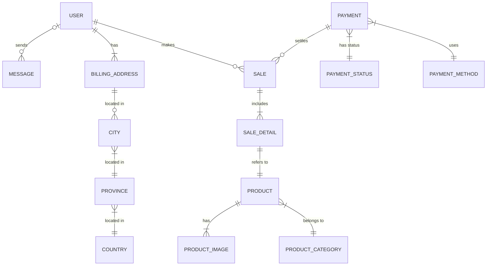

# Proyecto de Estudio!
    
**Estructura del documento principal:**

# SISTEMA DE VENTA DE ARCHIVOS DE IMPRESIÓN 3D “BITSTORE”

**Asignatura**: Bases de Datos I (FaCENA-UNNE)

**Integrantes**:
 - Integrante: Ramos Morton, Jorge Raúl	    DNI: 36.468.588

 - Integrante: Peralta, Nahuel Maximiliano	DNI: 44.406.632

 - Integrante: Marcori, Joel Jesús		    DNI: 43.346.344

**Año**: 2024

## CAPÍTULO I: INTRODUCCIÓN

### Tema

El trabajo se centra en el diseño y la implementación de una base de datos que soporte las operaciones de una tienda virtual dedicada a la venta de archivos de impresión 3D. El sistema contempla diferentes roles de usuarios, cada uno con niveles específicos (credenciales) de acceso a la información, siendo estos Usuario Visitante, Usuario Registrado, Administrador de Productos, Administrador de Consultas y Administrador Usuarios.
Este trabajo práctico busca investigar cómo estructurar la base de datos para satisfacer las necesidades de estos roles, asegurando la integridad de los datos y la eficiencia en la consulta y gestión de la información. 

### Definición o planteamiento del problema

El trabajo práctico parte de la necesidad de desarrollar una base de datos para una tienda virtual de archivos de impresión 3D que sea eficiente y segura. El problema central es cómo estructurar dicha base de datos para que soporte las operaciones esenciales del negocio, garantizando al mismo tiempo la protección de los datos sensibles y el acceso controlado a la información por parte de diferentes usuarios.
Algunas preguntas clave que guían la investigación son:
¿Cómo implementar un sistema de roles que permita un acceso seguro a las diferentes secciones de la base de datos?
¿Qué medidas se deben tomar para garantizar que los datos de los productos y los mensajes se manejen de forma eficiente y segura?
¿Cómo asegurar que el sistema sea escalable y mantenga su rendimiento a medida que aumente la cantidad de archivos de impresión 3D y usuarios?
Este problema incita a investigar la mejor manera de gestionar los datos de la tienda, permitiendo que diferentes roles (publicador, consultor, comprador de archivos, administrador) realicen sus funciones sin comprometer la seguridad ni la eficiencia del sistema.

### Objetivo General
El objetivo general del trabajo práctico es diseñar e implementar una base de datos segura y eficiente para una tienda virtual de venta de archivos de impresión 3D, que permita la correcta gestión de productos y mensajes, y que garantice el control de acceso adecuado mediante la división de roles de usuarios (publicador, consultor y administrador). Este objetivo responde a la necesidad de crear un sistema de información que proteja los datos sensibles y que al mismo tiempo facilite la operación eficiente del negocio.

### Objetivos Específicos
Definir y estructurar los roles de usuario: Desarrollar un sistema que permita a los publicadores, consultores y administradores realizar sus funciones con un acceso controlado a las tablas de la base de datos, asegurando que cada rol tenga los permisos necesarios y adecuados.

Implementar medidas de seguridad en el acceso a la información: Desarrollar mecanismos que aseguren la protección de los datos sensibles, como los mensajes y productos, limitando el acceso solo a los usuarios autorizados y estableciendo permisos adecuados.

Optimizar la gestión de archivos de impresión 3D y mensajes: Diseñar la base de datos para que permita la carga, consulta y modificación de archivos y mensajes de manera eficiente, asegurando la integridad de la información.

Escalabilidad del sistema: Asegurar que la base de datos esté preparada para manejar un crecimiento en la cantidad de archivos, usuarios y transacciones sin afectar su rendimiento.

Garantizar la integridad de los datos: Implementar reglas de integridad referencial y consistencia de los datos, evitando problemas como duplicaciones, accesos no autorizados y pérdida de información crítica.

Con estos objetivos, el trabajo busca brindar una solución que no solo responda a la necesidad de gestionar la venta de archivos de impresión 3D, sino que también proteja los datos y optimice el funcionamiento de la tienda virtual.

### Alcance
El proyecto abarcará las siguientes áreas:

Diseño de la base de datos: Se creará una estructura de base de datos que soporte las operaciones de una tienda virtual de venta de archivos de impresión 3D. Esto incluye la gestión de productos, usuarios, roles, transacciones y consultas de manera eficiente y segura.

Gestión de roles y permisos: Se implementarán diferentes roles de usuario con niveles de acceso adecuados, tales como Usuario Visitante, Usuario Registrado y diversos subroles de Administrador (productos, consultas y usuarios). Cada rol tendrá permisos específicos para realizar sus funciones dentro del sistema.
Seguridad y control de acceso: Se desarrollarán mecanismos de seguridad para proteger los datos sensibles, como la información personal de los usuarios. Se implementará el principio de privilegios mínimos para asegurar que cada usuario solo tenga acceso a las funciones que necesita.

Escalabilidad: El sistema será diseñado para escalar adecuadamente, permitiendo un crecimiento en la cantidad de productos, usuarios y transacciones sin afectar el rendimiento.

Optimización de la gestión de archivos: La base de datos permitirá la gestión eficiente de los archivos de impresión 3D, desde su carga hasta la consulta y modificación, asegurando que la información esté organizada y sea accesible de manera rápida.

### Limitaciones

Integración con sistemas de pago: El proyecto no se centrará en la gestión de facturación ni en los procesos detallados relacionados con los sistemas de pago, tales como la seguridad de tarjetas de crédito, la validación de tarjetas o la verificación de identidad para procesar transacciones.

Verificación de direcciones: Aunque se contemplará una tabla de direcciones de facturación (BillingAddress), no se llevará a cabo una validación en tiempo real de la validez o autenticidad de las direcciones ingresadas. Estas serán tratadas como datos de ejemplo y no se profundizará en su verificación.

Gestión de copias de seguridad: Aunque la base de datos está diseñada para ser eficiente y segura, la creación y gestión de copias de seguridad podría no estar completamente automatizada, lo que introduce el riesgo de pérdida de datos en caso de fallos del sistema o errores humanos.

## CAPITULO II: MARCO CONCEPTUAL O REFERENCIAL

**TEMA 1 " ---- "** 

**TEMA 2 " ----- "** 

## CAPÍTULO III: METODOLOGÍA SEGUIDA 

 **a) Cómo se realizó el Trabajo Práctico**

 **b) Herramientas (Instrumentos y procedimientos)**

## CAPÍTULO IV: DESARROLLO DEL TEMA / PRESENTACIÓN DE RESULTADOS 

### Diagrama conceptual (opcional)
Ejemplo usando Live Editor https://mermaid.js.org/ (ejemplo opcional)

### Diagrama relacional

### Diccionario de datos

Acceso al documento [PDF]([doc/diccionario_datos.pdf](https://github.com/nahuperalta12/basesdatos_proyecto_estudio/blob/main/doc/DiccionarioDeDatos.pdf)) del diccionario de datos.

### Desarrollo TEMA 1 "----"

### Desarrollo TEMA 2 "----"

## CAPÍTULO V: CONCLUSIONES

## BIBLIOGRAFÍA DE CONSULTA

 1. List item
 2. List item
 3. List item
 4. List item
 5. List item

