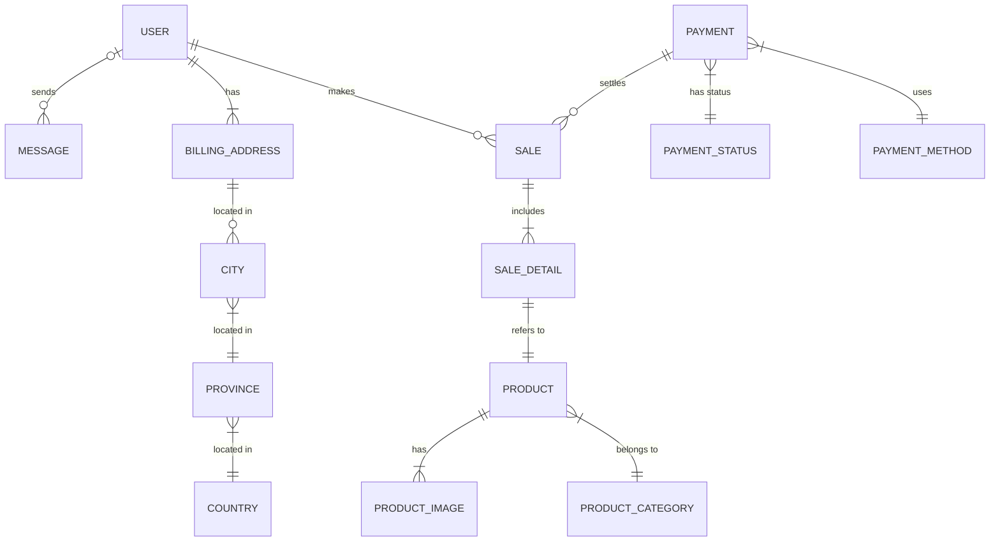

# Proyecto de Estudio

# SISTEMA DE VENTA DE ARCHIVOS DE IMPRESIÓN 3D “BITSTORE”


**Asignatura**: Bases de Datos I (FaCENA-UNNE)

**Integrantes**:
 - Integrante: Ramos Morton, Jorge Raúl	    DNI: 36.468.588

 - Integrante: Peralta, Nahuel Maximiliano	DNI: 44.406.632

 - Integrante: Marcori, Joel Jesús		    DNI: 43.346.344


**Año**: 2024

## CAPÍTULO I: INTRODUCCIÓN

### Tema

El trabajo se centra en el diseño y la implementación de una base de datos que soporte las operaciones de una tienda virtual dedicada a la venta de archivos de impresión 3D. El sistema contempla diferentes roles de usuarios, cada uno con niveles específicos (credenciales) de acceso a la información, siendo estos Usuario Visitante, Usuario Registrado, Administrador de Productos, Administrador de Consultas y Administrador Usuarios.
Este trabajo práctico busca investigar cómo estructurar la base de datos para satisfacer las necesidades de estos roles, asegurando la integridad de los datos y la eficiencia en la consulta y gestión de la información. 

### Definición o planteamiento del problema

El trabajo práctico parte de la necesidad de desarrollar una base de datos para una tienda virtual de archivos de impresión 3D que sea eficiente y segura. El problema central es cómo estructurar dicha base de datos para que soporte las operaciones esenciales del negocio, garantizando al mismo tiempo la protección de los datos sensibles y el acceso controlado a la información por parte de diferentes usuarios.
Algunas preguntas clave que guían la investigación son:
¿Cómo implementar un sistema de roles que permita un acceso seguro a las diferentes secciones de la base de datos?
¿Qué medidas se deben tomar para garantizar que los datos de los productos y los mensajes se manejen de forma eficiente y segura?
¿Cómo asegurar que el sistema sea escalable y mantenga su rendimiento a medida que aumente la cantidad de archivos de impresión 3D y usuarios?
Este problema incita a investigar la mejor manera de gestionar los datos de la tienda, permitiendo que diferentes roles (publicador, consultor, comprador de archivos, administrador) realicen sus funciones sin comprometer la seguridad ni la eficiencia del sistema.

### Objetivo General
El objetivo general del trabajo práctico es diseñar e implementar una base de datos segura y eficiente para una tienda virtual de venta de archivos de impresión 3D, que permita la correcta gestión de productos y mensajes, y que garantice el control de acceso adecuado mediante la división de roles de usuarios (publicador, consultor y administrador). Este objetivo responde a la necesidad de crear un sistema de información que proteja los datos sensibles y que al mismo tiempo facilite la operación eficiente del negocio.

### Objetivos Específicos
- Definir y estructurar los roles de usuario: Desarrollar un sistema que permita a los publicadores, consultores y administradores realizar sus funciones con un acceso controlado a las tablas de la base de datos, asegurando que cada rol tenga los permisos necesarios y adecuados.

- Implementar medidas de seguridad en el acceso a la información: Desarrollar mecanismos que aseguren la protección de los datos sensibles, como los mensajes y productos, limitando el acceso solo a los usuarios autorizados y estableciendo permisos adecuados.

- Optimizar la gestión de archivos de impresión 3D y mensajes: Diseñar la base de datos para que permita la carga, consulta y modificación de archivos y mensajes de manera eficiente, asegurando la integridad de la información.

- Escalabilidad del sistema: Asegurar que la base de datos esté preparada para manejar un crecimiento en la cantidad de archivos, usuarios y transacciones sin afectar su rendimiento.

- Garantizar la integridad de los datos: Implementar reglas de integridad referencial y consistencia de los datos, evitando problemas como duplicaciones, accesos no autorizados y pérdida de información crítica.

Con estos objetivos, el trabajo busca brindar una solución que no solo responda a la necesidad de gestionar la venta de archivos de impresión 3D, sino que también proteja los datos y optimice el funcionamiento de la tienda virtual.

### Alcance
El proyecto abarcará las siguientes áreas:

- Diseño de la base de datos: Se creará una estructura de base de datos que soporte las operaciones de una tienda virtual de venta de archivos de impresión 3D. Esto incluye la gestión de productos, usuarios, roles, transacciones y consultas de manera eficiente y segura.

- Gestión de roles y permisos: Se implementarán diferentes roles de usuario con niveles de acceso adecuados, tales como Usuario Visitante, Usuario Registrado y diversos subroles de Administrador (productos, consultas y usuarios). Cada rol tendrá permisos específicos para realizar sus funciones dentro del sistema.
Seguridad y control de acceso: Se desarrollarán mecanismos de seguridad para proteger los datos sensibles, como la información personal de los usuarios. Se implementará el principio de privilegios mínimos para asegurar que cada usuario solo tenga acceso a las funciones que necesita.

- Escalabilidad: El sistema será diseñado para escalar adecuadamente, permitiendo un crecimiento en la cantidad de productos, usuarios y transacciones sin afectar el rendimiento.

- Optimización de la gestión de archivos: La base de datos permitirá la gestión eficiente de los archivos de impresión 3D, desde su carga hasta la consulta y modificación, asegurando que la información esté organizada y sea accesible de manera rápida.

### Limitaciones

- Integración con sistemas de pago: El proyecto no se centrará en la gestión de facturación ni en los procesos detallados relacionados con los sistemas de pago, tales como la seguridad de tarjetas de crédito, la validación de tarjetas o la verificación de identidad para procesar transacciones.

- Verificación de direcciones: Aunque se contemplará una tabla de direcciones de facturación (BillingAddress), no se llevará a cabo una validación en tiempo real de la validez o autenticidad de las direcciones ingresadas. Estas serán tratadas como datos de ejemplo y no se profundizará en su verificación.

- Gestión de copias de seguridad: Aunque la base de datos está diseñada para ser eficiente y segura, la creación y gestión de copias de seguridad podría no estar completamente automatizada, lo que introduce el riesgo de pérdida de datos en caso de fallos del sistema o errores humanos.


## CAPITULO II: MARCO CONCEPTUAL O REFERENCIAL

### Tema 1

### Manejo de permisos a nivel de usuarios de base de datos

#### Conceptos Fundamentales

El manejo de permisos y roles en sistemas de bases de datos es un aspecto fundamental de la seguridad y administración, cuyo objetivo es controlar y restringir el acceso a los datos. Estos sistemas permiten a los administradores asignar permisos específicos a diferentes usuarios o grupos, garantizando que cada uno pueda realizar solo las operaciones autorizadas y manteniendo la integridad y confidencialidad de la información almacenada (Silberschatz, Korth, & Sudarshan, 2014).

Los permisos en bases de datos se refieren a los derechos otorgados a un usuario o rol para ejecutar ciertas acciones, como leer, escribir, o modificar datos. Estos permisos pueden ser asignados a nivel de objeto (como tablas o vistas) y pueden variar desde acceso total (administrador) hasta permisos limitados, como solo lectura (Elmasri, 2007). Ramakrishnan (2007) explica que la correcta configuración de estos permisos es esencial para prevenir accesos no autorizados y mantener la seguridad de los datos sensibles.

Por otro lado, los roles en una base de datos permiten agrupar permisos comunes que pueden ser asignados a múltiples usuarios. Este mecanismo facilita la administración, ya que, en lugar de asignar permisos individualmente a cada usuario, basta con asignarles un rol que contenga los permisos necesarios. Los roles suelen dividirse en categorías, como "lectores" (usuarios con permiso de solo lectura) o "editores" (usuarios con permisos de escritura y modificación) (Piattini, 2007). Además, los roles pueden establecer jerarquías, donde roles superiores heredan permisos de roles inferiores, promoviendo una administración eficiente y ordenada (Aguirre Sánchez, 2021).

#### Aplicación de Permisos y Roles en la Práctica

En la práctica, los administradores de bases de datos configuran permisos a nivel de usuario y de rol para cumplir con los requerimientos de acceso específicos de la organización. Esta configuración implica la creación de usuarios con permisos diferenciados y la implementación de roles para tareas comunes. Un caso frecuente es la configuración de un rol de "solo lectura", que permite a ciertos usuarios consultar datos sin modificarlos. En el sistema SQL Server, es posible crear un esquema de seguridad que asigne estos permisos de manera personalizada, garantizando un control detallado del acceso (Tiebas, 2017).
Para garantizar la eficacia de estos permisos, se recomienda realizar pruebas periódicas y documentar el comportamiento de los usuarios, así como verificar la compatibilidad de los permisos con las políticas de seguridad de la organización (Sánchez Serrano, 2010). Este enfoque permite anticipar y mitigar riesgos de seguridad, asegurando que solo los usuarios autorizados puedan acceder y modificar la información.

#### Conclusión

La implementación de permisos y roles en bases de datos es un componente crucial de la administración y seguridad de datos. Un enfoque estructurado en la asignación de permisos, combinado con roles jerárquicos y pruebas de acceso, optimiza el manejo de la seguridad y facilita el cumplimiento de las políticas de privacidad y protección de datos. La aplicación práctica de estos conceptos permite que los sistemas de bases de datos mantengan su integridad y protejan la información frente a accesos no autorizados.

### Tema 2

### Procedimientos y funciones almacenadas

#### Conceptos Fundamentales

La mayoría de los SGBD permiten escribir procedimientos y funciones en un lenguaje de programación de propósito general. 
De forma global, para declarar un procedimiento se realizará dela siguiente manera

~~~sql
CREATE PROCEDURE <nombre_procedimiento> (<parámetros>) 
<declaraciones locales> 
<cuerpo del procedimiento>;
~~~

Los parámetros y las declaraciones tienen carácter opcional, especificandose únicamente cuando sea necesario. 
Por otro lado, las funciones necesitan que se determine algún tipo de devolución. 
Esta se refleja con el comando RETURNS a la hora de crear la función. 
La declaración de una función se realiza de la siguiente forma:

~~~sql
CREATE FUNCTION <nombre_función> (<parámetros>) 
RETURNS (tipo de devolución> 
<declaraciones locales> 
<cuerpo de la función>;
~~~
  
En ocasiones el procedimiento o función se escribe en un lenguaje de programación de propósito general.
En estos casos hay que especificar el nombre del fichero donde se va a almacenar el código del programa, además del lenguaje de programación empleado.
La sintaxis sería:

~~~sql
CREATE PROCEDURE <nombre del procedimiento o función> (<parámetros>)
LANGUAGE <nombre del lenguaje de programacióm 
EXTERNAL NAME <ruta del fichero>;
~~~

Para llamar a un procedimiento o función se puede utilizar la sentencia CALL que invoca un procedimiento almacenado. La sentencia tiene la siguiente forma:

~~~sql
CALL <nombre del procedimiento o función> (<argumentos>);
~~~

### Tema 3

### Optimización de Consultas en Bases de Datos mediante el Uso de Índices

En los sistemas que gestionan grandes volúmenes de datos, la optimización de consultas es esencial para el rendimiento eficiente de las aplicaciones. Las consultas no optimizadas son un problema recurrente, ya que pueden provocar tiempos de respuesta prolongados y un mayor uso de recursos del sistema, lo cual afecta la experiencia del usuario. Entre las principales causas se encuentran errores en la codificación de consultas SQL, la falta de estrategias de indexación adecuadas y, en algunos casos, una infraestructura de hardware insuficiente. Este problema se agrava en organizaciones sin administradores de bases de datos (DBA) que optimicen el rendimiento del sistema.

#### Importancia de los Índices en la Optimización de Consultas

Los índices en bases de datos relacionales son estructuras diseñadas para mejorar el tiempo de respuesta en la recuperación de datos. Al reducir la cantidad de registros que deben explorarse, los índices aceleran el procesamiento de las consultas y minimizan la carga en memoria y procesador. Sin embargo, su uso debe ser estratégico, pues los índices también ocupan espacio y pueden ralentizar la inserción, actualización o eliminación de datos.

#### Tipos de Índices y sus Aplicaciones

Existen varios tipos de índices, cada uno adecuado para contextos específicos de uso:

- **Índice Agrupado (Clustered Index)**: Este índice determina el orden físico de los datos en una tabla, lo que significa que los registros se organizan en disco en función de la clave primaria. Solo se permite un índice agrupado por tabla. Es especialmente útil para tablas grandes donde las consultas implican rangos de datos específicos.
  
    ```sql
    CREATE CLUSTERED INDEX IX_venta_numeroVenta ON ventas (numeroVenta);
    ```

- **Índice No Agrupado (Nonclustered Index)**: Este índice no altera el orden físico de los datos, sino que crea una estructura separada con copias de las claves de índice y las columnas asociadas, facilitando búsquedas rápidas sin reorganizar la tabla. Es adecuado para columnas que se consultan con frecuencia pero no son claves primarias.
  
    ```sql
    CREATE NONCLUSTERED INDEX IX_ventas_numeroVenta ON ventas (numeroVenta);
    ```

- **Índice Único (Unique Index)**: Asegura que los valores en una columna sean únicos, útil para campos como correos electrónicos o identificaciones. Es similar a un índice no agrupado pero incluye restricciones de unicidad.
  
    ```sql
    CREATE UNIQUE INDEX idx_productos_id_producto ON productos (id_producto);
    ```

- **Índice Filtrado (Filtered Index)**: Aplica filtros específicos en una columna para incluir solo ciertos registros en el índice. Este tipo de índice reduce el tamaño del índice y mejora la velocidad de las consultas al segmentar datos específicos, útil para consultas sobre un subconjunto de datos.
  
    ```sql
    CREATE INDEX idx_ventas_recientes ON ventas (fecha_venta) WHERE fecha_venta >= '2022-01-01';
    ```

- **Índice de Texto Completo (Full-Text Index)**: Diseñado para búsquedas de palabras clave y frases en columnas de texto largo, útil para campos de texto como descripciones o comentarios. Mejora la eficiencia de las consultas sobre grandes volúmenes de texto.
  
    ```sql
    CREATE FULLTEXT INDEX ON productos (descripcion) KEY INDEX idx_productos_id_producto;
    ```

- **Índice Compuesto**: Contiene múltiples columnas en un solo índice, lo cual permite una búsqueda combinada. Es especialmente útil para consultas que combinan varias columnas, como `nombre` y `apellido` en registros de personas.

#### Buenas Prácticas en el Uso de Índices

Para lograr una optimización efectiva, es importante considerar las prácticas recomendadas al implementar índices:

1. **Análisis de Consultas Frecuentes**: Es fundamental identificar las consultas que se realizan con mayor frecuencia para determinar las columnas que deben ser indexadas.

2. **Equilibrio entre Rendimiento de Lectura y Costo de Escritura**: Los índices aceleran las búsquedas, pero ralentizan las operaciones de inserción, actualización y eliminación. Por ello, el diseño de índices debe balancearse en función de las necesidades del sistema.

3. **Revisión y Actualización de Índices**: Dado que las necesidades de la base de datos pueden cambiar, es importante revisar periódicamente la estructura de los índices y eliminar aquellos que ya no sean necesarios o ajustar los existentes.

4. **Monitoreo del Impacto de los Índices**: Es recomendable monitorear el impacto de los índices en el rendimiento del sistema y ajustar su uso según las métricas de tiempo de respuesta y carga en los recursos.

#### Conclusión

La optimización de consultas mediante el uso de índices es un proceso complejo que involucra desde la correcta codificación de las consultas hasta el mantenimiento de los índices y la configuración adecuada del hardware. La implementación de índices adecuados mejora significativamente el rendimiento de una base de datos, reduciendo tiempos de respuesta y aumentando la eficiencia de los recursos. No obstante, es crucial adaptar continuamente el diseño de índices conforme evolucionen las necesidades de la base de datos y las aplicaciones que dependen de ella.

La optimización de consultas, basada en una estrategia integral de índices, es clave para mantener una experiencia de usuario satisfactoria y asegurar el rendimiento óptimo en entornos con grandes volúmenes de datos. Implementar y gestionar índices de manera eficiente permite maximizar el uso de los recursos del sistema y mantener un equilibrio entre rendimiento y costo, esencial para un sistema de bases de datos bien optimizado.

### Tema 4

# Tema 4: "Triggers en Bases de Datos"

Un **trigger** o disparador es una estructura de código almacenado en una base de datos que se ejecuta automáticamente al detectarse un evento específico en una tabla. Estos eventos pueden ser operaciones de inserción, actualización o eliminación de datos y permiten realizar acciones adicionales de forma automática, tales como validaciones, auditorías, o replicación de información. Los triggers se configuran para responder a ciertos cambios en las tablas, asegurando la consistencia de los datos, y son ampliamente utilizados para reforzar reglas de negocio o mejorar la seguridad de la base de datos.

## Tipos y Ejecución de Triggers en SQL

Los triggers en SQL se dividen en dos categorías principales, cada una con sus propios escenarios de uso:

1. **Triggers DML (Data Manipulation Language)**: Se activan con eventos de manipulación de datos como las declaraciones `INSERT`, `UPDATE` o `DELETE`. Este tipo es el más utilizado, ya que permite monitorear y reaccionar ante cambios en los datos de una tabla.
   
2. **Triggers DDL (Data Definition Language)**: Se ejecutan en respuesta a eventos que modifican la estructura de la base de datos, tales como la creación, modificación o eliminación de tablas y otros objetos. También pueden activarse ante ciertos eventos del servidor, como cambios en la seguridad.

Cada tipo de trigger DML se configura para ejecutarse en diferentes momentos respecto al evento que lo desencadena. Estos tipos son:

- **AFTER [INSERT, UPDATE, DELETE]**: Se ejecutan después de que se complete la instrucción principal. Esto permite que el trigger acceda a los datos finales, ideales para tareas de auditoría o registro.
  
- **INSTEAD OF [INSERT, UPDATE, DELETE]**: Este tipo reemplaza el evento que lo activa, es decir, no se realiza el cambio original. Estos triggers son muy útiles en vistas complejas o en escenarios de integridad referencial entre bases de datos, donde se debe controlar más estrictamente el flujo de operaciones.

## Creación de Triggers: Pasos y Sintaxis

Para definir un trigger en SQL, se deben seguir dos pasos fundamentales:

1. **Definir la función disparadora**: Este es el código que contiene las instrucciones que se ejecutarán al activarse el trigger. La función disparadora debe incluir todas las acciones o reglas que se deseen aplicar cuando se cumpla el evento específico.

2. **Crear el trigger propiamente dicho**: Utilizando el comando `CREATE TRIGGER`, se asocia la función disparadora al trigger y se configuran los parámetros que especifican cuándo y cómo debe activarse el trigger.

La sintaxis básica para crear un trigger en SQL es la siguiente:

-- Creación del trigger en SQL
```sql
CREATE
    [DEFINER = { usuario | CURRENT_USER }]  -- Especifica el usuario que define el trigger
    TRIGGER nombre_del_trigger              -- Nombre que se asignará al trigger
    momento_evento evento_disparo          -- El momento en que se ejecutará el trigger (BEFORE o AFTER)
    ON nombre_tabla FOR EACH ROW           -- La tabla en la que se activa el trigger
    [orden_trigger]                        -- Orden de ejecución en caso de múltiples triggers
    cuerpo_del_trigger                     -- El bloque de código que contiene las acciones del trigger
```
## Eventos que Desencadenan Triggers

Un trigger puede responder a los siguientes eventos en una tabla:

- **INSERT**: Cuando se inserta una nueva fila en la tabla.
- **UPDATE**: Cuando se actualizan una o más columnas de una fila existente.
- **DELETE**: Cuando se elimina una fila de la tabla.

Al activarse un trigger en uno de estos eventos, puede llevar a cabo acciones de auditoría, verificación de permisos, cálculo de valores derivados y otras tareas automatizadas.

## Ventajas de Usar Triggers en Bases de Datos

El uso de triggers en una base de datos aporta una serie de beneficios que facilitan la administración de los datos y la implementación de reglas de negocio. Algunas de las principales ventajas son:

- **Automatización de valores derivados**: Permiten calcular automáticamente ciertos valores de columnas, lo cual reduce la intervención manual.
  
- **Aplicación de integridad referencial**: Los triggers pueden garantizar que se respeten las relaciones entre tablas, evitando datos inconsistentes.
  
- **Registro de eventos**: Capturan información sobre accesos y modificaciones en la base de datos, útil para auditoría y trazabilidad.
  
- **Sincronización de datos**: Permiten replicar información en tiempo real entre tablas, asegurando que los datos se mantengan actualizados de forma automática.
  
- **Control de acceso y seguridad**: Ayudan a establecer restricciones sobre ciertas operaciones, mejorando la protección de los datos sensibles.
  
- **Prevención de transacciones no válidas**: Los triggers pueden bloquear operaciones no permitidas, minimizando el riesgo de errores de usuario.

## Conclusión sobre el Uso de Triggers

En las pruebas realizadas, los triggers demostraron ser efectivos para garantizar la integridad y la seguridad de la base de datos. Los triggers de auditoría registraron adecuadamente el estado previo de los datos en cada operación de modificación, incluyendo detalles como el tipo de cambio, usuario, fecha y hora. Esto proporciona un nivel de control detallado y fiable sobre las operaciones en la base de datos.

Los triggers de seguridad, por otro lado, mostraron ser efectivos al impedir eliminaciones no autorizadas en tablas sensibles. Este mecanismo ofrece un nivel adicional de protección en las tablas críticas, y el sistema permite desactivar temporalmente los triggers cuando sea necesario para realizar operaciones excepcionales. Esta flexibilidad es esencial para situaciones imprevistas y contribuye a una gestión más segura y controlada de los datos.


## CAPÍTULO III: METODOLOGÍA SEGUIDA 


 **a) Cómo se realizó el Trabajo Práctico**


 **b) Herramientas (Instrumentos y procedimientos)**


## CAPÍTULO IV: DESARROLLO DEL TEMA / PRESENTACIÓN DE RESULTADOS 

### Diagrama conceptual
Hecho usando: https://stackedit.io/app# 

### Diagrama relacional
 

### Script de la Base de Datos
 Acceso [Script](https://github.com/nahuperalta12/basesdatos_proyecto_estudio/blob/main/script/script_bdd_3DBitStore.sql)

 ### Lote de Prueba

 Acceso al [Lote de Prueba](https://github.com/nahuperalta12/basesdatos_proyecto_estudio/blob/main/script/lote_de_pruebas_3DBitStore.sql)

### Diccionario de datos
Acceso al documento [PDF](https://github.com/nahuperalta12/basesdatos_proyecto_estudio/blob/524fd8625e506f429b0b5eefbd2a18421e2cc817/doc/DiccionarioDeDatos.pdf) del diccionario de datos.

### Documento con formato presentacion
Se creo un documento con el formato de presentacion del proyecto. El mismo no contiene el Script de la Base de Datos ni el Diccionario del mismo.
Acceso al documento [PDF](https://github.com/nahuperalta12/basesdatos_proyecto_estudio/blob/main/proyecto_bdd1_grupo9.pdf)

### Roles
Se van a dividir los usuarios en tres grupos con diferentes niveles de acceso y funcionalidades, es decir, roles, los cuales son: usuarios no registrados, usuarios registrados, y administradores. 
Los roles quedarían agrupados de la siguiente manera:

1. Usuarios sin registrar (visitantes)

Este rol tiene acceso limitado, puede ver productos y enviar consultas.

Permisos:
- SELECT en la tabla Product: para ver productos.
-	SELECT en la tabla Product_image: para ver las imágenes de los productos.
-	SELECT en la tabla Product_category: para ver las categorías de los productos.
-	INSERT en la tabla Message: para enviar consultas.

2. Usuarios registrados

Los usuarios registrados tienen más interacciones con la página, como agregar productos a un carrito, realizar compras, y ver el estado de sus transacciones.

Acciones:
-	Hacer todo lo que puede hacer un usuario sin registrar.
-	Realizar compras y pagar.
-	Ver el historial de compras y sus consultas.
-	Rol en la base de datos: usuario_registrado_rol

Este rol tiene permisos adicionales para realizar compras y ver el historial.

Permisos:
-	Permisos heredados de visitante_rol:
 -	SELECT en las tablas Product, Product_image, Product_category, Message.
 -	INSERT en la tabla Message.
 -	Permisos adicionales:
 - SELECT en la tabla Sale: para ver su historial de compras.
 - SELECT en la tabla Sale_detail: para ver los detalles de las compras.
 -	SELECT en la tabla Payment: para ver los métodos de pago.
 -	INSERT en la tabla Sale: para realizar compras.
 -	INSERT en la tabla Sale_detail: para añadir productos a la compra.
 -	SELECT en la tabla Message: para ver sus consultas anteriores.

4. Administradores
El administrador tiene un conjunto de permisos más amplios, ya que administra tanto los productos como a los usuarios y las consultas. Para no tener un usuario omnipotente, se dividirá este en varios subroles, dependiendo de las responsabilidades de cada administrador.

Subroles de administrador:
- Admin de productos: Maneja la gestión de los productos, como agregar, editar, o dar de baja/alta productos.
- Admin de consultas: Lee y responde a las consultas de los usuarios.
- Admin de usuarios: Gestiona a los usuarios, da de alta/baja cuentas, y puede cambiar los roles de otros usuarios.

Rol 1: admin_productos
Este rol puede gestionar productos.

Permisos:
-	SELECT, INSERT, UPDATE, DELETE en las tablas:
 -	Product: para gestionar productos.
 -	Product_image: para gestionar las imágenes de los productos.
 -	Product_category: para añadir o modificar categorías de productos.

Rol 2: admin_consultas
Este rol gestiona las consultas de usuarios y marca las consultas como leídas o respondidas.

Permisos:
-	SELECT, UPDATE en la tabla Message: para ver las consultas de los usuarios y marcarlas como leídas (read) o respondidas (reply).

Rol 3: admin_usuarios

Este rol puede gestionar usuarios y sus roles.

Permisos:
-	SELECT, INSERT, UPDATE, DELETE en la tabla User: para gestionar los usuarios.
-	UPDATE en la tabla User: para actualizar roles y otros atributos de usuarios.
-	SELECT en la tabla Message: para verificar consultas relacionadas a usuarios (si aplica).

Rol 4: admin_mantenimiento

Este rol se encarga de realizar tareas de mantenimiento rutinario de la base de datos, como la actualización de estadísticas, el reorganizado y la reconstrucción de índices, y la limpieza de registros de logs de actividad. Estos permisos permiten mantener el rendimiento y la integridad de la base de datos.

Permisos:
- ALTER INDEX en todas las tablas relevantes: Para reorganizar y reconstruir índices.
- UPDATE STATISTICS en todas las tablas: Para actualizar estadísticas de uso y mejorar el rendimiento de las consultas.
- TRUNCATE TABLE en tablas de logs temporales: Para limpiar registros de auditoría y log de actividad que ya no sean necesarios.
- EXECUTE en procedimientos de mantenimiento almacenados: Para ejecutar procedimientos que realicen mantenimiento programado en la base de datos.
- VIEW DATABASE STATE: Para monitorear el estado general de la base de datos y detectar posibles problemas de rendimiento.

Rol 5: admin_backup

Este rol es responsable de la administración de respaldos y la recuperación de la base de datos en caso de fallos. Los permisos de este rol aseguran que los datos puedan respaldarse y restaurarse según las políticas de recuperación de desastres.

Permisos:

- BACKUP DATABASE en la base de datos BD3DBitStore: Para realizar respaldos completos de la base de datos.
- BACKUP LOG en la base de datos BD3DBitStore: Para realizar respaldos de los registros de transacciones, permitiendo restaurar la base de datos a un punto específico en el tiempo.
- RESTORE DATABASE en BD3DBitStore (con precaución): Para realizar restauraciones en entornos de prueba o recuperación controlada, especialmente durante pruebas de recuperación.
- ALTER ANY CREDENTIAL: Para gestionar las credenciales necesarias para almacenamiento externo o nube si los respaldos se almacenan fuera del servidor local.
- VIEW DEFINITION: Para ver la estructura de los objetos en la base de datos al planificar respaldos y restauraciones.

Rol 6: admin_auditoría

Este rol supervisa el acceso y las modificaciones a la base de datos, enfocándose en la seguridad y el cumplimiento de políticas de acceso y uso. Este rol está orientado a la auditoría de las actividades, revisando y monitoreando el acceso a los datos y las operaciones críticas en la base de datos.

Permisos:

- VIEW SERVER STATE: Para monitorear el estado del servidor y la actividad general en el servidor de base de datos.
- SELECT en tablas de logs y auditoría: Para ver los registros de acceso y auditoría, analizando las actividades de los usuarios.
- EXECUTE en procedimientos de auditoría almacenados: Para ejecutar procedimientos de auditoría que recopilen y registren actividades críticas en la base de datos.
- ALTER TRACE: Para configurar y revisar trazas de auditoría en el servidor, recopilando información de acceso y actividad.
- VIEW AUDIT STATE: Para supervisar el estado de los objetos de auditoría en la base de datos.

Rol 7: admin_seguridad

Este rol se encarga de gestionar las configuraciones de seguridad de la base de datos, como permisos de acceso, configuración de usuarios y gestión de roles. Este rol es crítico para mantener una base de datos segura y acorde a las políticas de seguridad establecidas.

Permisos:

- ALTER ANY LOGIN: Para gestionar logins de usuarios a nivel de servidor, incluyendo la creación, modificación y eliminación.
- ALTER ANY USER: Para configurar usuarios dentro de la base de datos, asignar roles y modificar permisos.
- ALTER ROLE en roles de base de datos: Para modificar roles, agregar o eliminar miembros de los roles definidos.
- VIEW DATABASE STATE y VIEW SERVER STATE: Para monitorear actividades y configuraciones en el servidor y la base de datos, garantizando que los accesos se ajusten a las políticas de seguridad.
- GRANT, REVOKE y DENY permisos a nivel de base de datos: Para controlar el acceso a tablas, vistas, procedimientos y otros objetos según las necesidades de cada usuario.

### Resumen de los Roles:

 - visitante_rol: Acceso limitado, puede ver productos y enviar consultas.
 - usuario_registrado_rol: Puede hacer todo lo que el visitante hace más gestionar su carrito, hacer compras y ver su historial.
 - admin_productos: Gestiona productos.
 - admin_consultas: Gestiona consultas de usuarios.
 - admin_usuarios: Gestiona usuarios y roles.
 - admin_mantenimiento_rol: Realiza tareas de mantenimiento rutinario en la base de datos, como actualización de estadísticas, reorganización de índices y limpieza de registros de logs.
 - admin_backup_rol: Gestiona los respaldos y la restauración de la base de datos, asegurando la recuperación de datos en caso de fallos.
 - admin_auditoria_rol: Supervisa las actividades en la base de datos, centrado en la seguridad y el cumplimiento de las políticas de acceso.
 - admin_seguridad_rol: Administra la seguridad de la base de datos, gestionando usuarios, roles y permisos de acceso para proteger los datos.

### Consideraciones teóricas:
Modelo RBAC (Role-Based Access Control): Los roles y permisos se organizan con base en funciones organizacionales, permitiendo una asignación centralizada de permisos. Es una metodología eficiente para gestionar permisos en entornos complejos, evitando la asignación individual a cada usuario.
Principio de privilegio mínimo: Cada rol debe tener los permisos mínimos necesarios para realizar sus tareas, reduciendo el riesgo de acciones no autorizadas. Por ejemplo, un "Usuario Libre" solo tiene acceso a datos públicos, mientras que un "Administrador de Productos" solo tiene acceso a la gestión de productos, sin poder alterar usuarios o datos sensibles.
Separation of Duties (SoD): El administrador de productos no debe tener los mismos permisos que un administrador de usuarios o consultas, para prevenir abuso de poder y garantizar control interno.

### Impacto en la Seguridad
Principio de privilegios mínimos: Cada usuario solo tiene los permisos que necesita para realizar sus funciones, lo que minimiza el riesgo de accesos indebidos.
Roles segmentados: Al dividir los roles de administrador en subroles, se reduce el riesgo de errores humanos o abuso de privilegios.
Auditoría y control: Al tener roles definidos, se pueden auditar fácilmente las actividades de cada rol y detectar comportamientos sospechosos.

### Casos de Uso

1.Caso de Uso: Administradores


2. Caso de Uso: Usuario no Registrado y Registrado


### Desarrollo TEMA 1
[**TEMA 1 "Manejo de permisos a nivel de usuarios de base de datos"**](https://github.com/nahuperalta12/basesdatos_proyecto_estudio/blob/main/script/tema01_Manejo_de_permisos_a_nivel_de_usuarios_de_base_de_datos)

### Desarrollo TEMA 2
[**TEMA 2 "Procedimientos y Funciones Almacenadas"** ](https://github.com/nahuperalta12/basesdatos_proyecto_estudio/blob/main/script/tema02_Procedimientos_y_funciones_almacenadas)

### Desarrollo TEMA 3
[**TEMA 3 "Procedimientos y Funciones Almacenadas"** ](https://github.com/nahuperalta12/basesdatos_proyecto_estudio/blob/main/script/tema_03_Optimizacion_de_consultas_a_traves_de_indices)

### Desarrollo TEMA 4
[**TEMA 4 "Procedimientos y Funciones Almacenadas"** ](https://github.com/nahuperalta12/basesdatos_proyecto_estudio/blob/main/script/tema_04_triggers)

## CAPÍTULO V: CONCLUSIONES


## BIBLIOGRAFÍA DE CONSULTA

 1. Begg, C. E., Connolly, T. M. (2005). Sistemas de bases de datos: un enfoque práctico para diseño, implementación y gestión. España: Pearson Educación.
 2. Nieto Bernal, W. y Capacho Portilla, J. R. (2017). Diseño de base de datos. Barranquilla, Colombia: Universidad del Norte. https://elibro.net/es/lc/unne/titulos/70030.
 3. Pulido Romero, E. Escobar Domínguez, Ó. y Núñez Pérez, J. Á. (2019). Base de datos. Ciudad de México, Grupo Editorial Patria. https://elibro.net/es/lc/unne/titulos/121283.
 4. Conesa Caralt, J. y Casas Roma, J. (2014). Diseño conceptual de bases de datos en UML. Barcelona, Spain: Editorial UOC. Recuperado de https://elibro.net/es/lc/unne/titulos/57635.
 5. Manzanilla Vidal, W., Feliciano Morales, S., Alvarez Hilario, V., Solis Carmona, E., & Molina, F. (2018). Implementación de herramientas para optimizar consultas de acceso a la información de bases de datos relacionales.
 6. Salazar, E. (2015). Optimización de los tiempos de respuestas en una base de datos. Gaceta Sana, 56.

