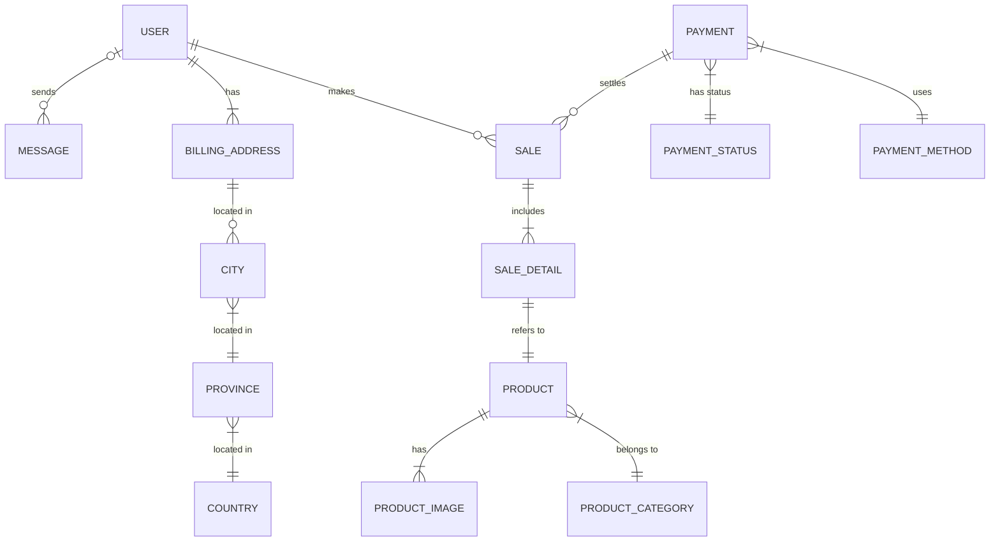

# Proyecto de Estudio

# SISTEMA DE VENTA DE ARCHIVOS DE IMPRESIÓN 3D “BITSTORE”

**Asignatura**: Bases de Datos I (FaCENA-UNNE)

**Integrantes**:
 - Integrante: Ramos Morton, Jorge Raúl	    DNI: 36.468.588

 - Integrante: Peralta, Nahuel Maximiliano	DNI: 44.406.632

 - Integrante: Marcori, Joel Jesús		    DNI: 43.346.344

**Año**: 2024

## CAPÍTULO I: INTRODUCCIÓN

### Tema

El trabajo se centra en el diseño y la implementación de una base de datos que soporte las operaciones de una tienda virtual dedicada a la venta de archivos de impresión 3D. El sistema contempla diferentes roles de usuarios, cada uno con niveles específicos (credenciales) de acceso a la información, siendo estos Usuario Visitante, Usuario Registrado, Administrador de Productos, Administrador de Consultas y Administrador Usuarios.
Este trabajo práctico busca investigar cómo estructurar la base de datos para satisfacer las necesidades de estos roles, asegurando la integridad de los datos y la eficiencia en la consulta y gestión de la información. 

### Definición o planteamiento del problema

El trabajo práctico parte de la necesidad de desarrollar una base de datos para una tienda virtual de archivos de impresión 3D que sea eficiente y segura. El problema central es cómo estructurar dicha base de datos para que soporte las operaciones esenciales del negocio, garantizando al mismo tiempo la protección de los datos sensibles y el acceso controlado a la información por parte de diferentes usuarios.
Algunas preguntas clave que guían la investigación son:
¿Cómo implementar un sistema de roles que permita un acceso seguro a las diferentes secciones de la base de datos?
¿Qué medidas se deben tomar para garantizar que los datos de los productos y los mensajes se manejen de forma eficiente y segura?
¿Cómo asegurar que el sistema sea escalable y mantenga su rendimiento a medida que aumente la cantidad de archivos de impresión 3D y usuarios?
Este problema incita a investigar la mejor manera de gestionar los datos de la tienda, permitiendo que diferentes roles (publicador, consultor, comprador de archivos, administrador) realicen sus funciones sin comprometer la seguridad ni la eficiencia del sistema.

### Objetivo General
El objetivo general del trabajo práctico es diseñar e implementar una base de datos segura y eficiente para una tienda virtual de venta de archivos de impresión 3D, que permita la correcta gestión de productos y mensajes, y que garantice el control de acceso adecuado mediante la división de roles de usuarios (publicador, consultor y administrador). Este objetivo responde a la necesidad de crear un sistema de información que proteja los datos sensibles y que al mismo tiempo facilite la operación eficiente del negocio.

### Objetivos Específicos
Definir y estructurar los roles de usuario: Desarrollar un sistema que permita a los publicadores, consultores y administradores realizar sus funciones con un acceso controlado a las tablas de la base de datos, asegurando que cada rol tenga los permisos necesarios y adecuados.

Implementar medidas de seguridad en el acceso a la información: Desarrollar mecanismos que aseguren la protección de los datos sensibles, como los mensajes y productos, limitando el acceso solo a los usuarios autorizados y estableciendo permisos adecuados.

Optimizar la gestión de archivos de impresión 3D y mensajes: Diseñar la base de datos para que permita la carga, consulta y modificación de archivos y mensajes de manera eficiente, asegurando la integridad de la información.

Escalabilidad del sistema: Asegurar que la base de datos esté preparada para manejar un crecimiento en la cantidad de archivos, usuarios y transacciones sin afectar su rendimiento.

Garantizar la integridad de los datos: Implementar reglas de integridad referencial y consistencia de los datos, evitando problemas como duplicaciones, accesos no autorizados y pérdida de información crítica.

Con estos objetivos, el trabajo busca brindar una solución que no solo responda a la necesidad de gestionar la venta de archivos de impresión 3D, sino que también proteja los datos y optimice el funcionamiento de la tienda virtual.

### Alcance
El proyecto abarcará las siguientes áreas:

Diseño de la base de datos: Se creará una estructura de base de datos que soporte las operaciones de una tienda virtual de venta de archivos de impresión 3D. Esto incluye la gestión de productos, usuarios, roles, transacciones y consultas de manera eficiente y segura.

Gestión de roles y permisos: Se implementarán diferentes roles de usuario con niveles de acceso adecuados, tales como Usuario Visitante, Usuario Registrado y diversos subroles de Administrador (productos, consultas y usuarios). Cada rol tendrá permisos específicos para realizar sus funciones dentro del sistema.
Seguridad y control de acceso: Se desarrollarán mecanismos de seguridad para proteger los datos sensibles, como la información personal de los usuarios. Se implementará el principio de privilegios mínimos para asegurar que cada usuario solo tenga acceso a las funciones que necesita.

Escalabilidad: El sistema será diseñado para escalar adecuadamente, permitiendo un crecimiento en la cantidad de productos, usuarios y transacciones sin afectar el rendimiento.

Optimización de la gestión de archivos: La base de datos permitirá la gestión eficiente de los archivos de impresión 3D, desde su carga hasta la consulta y modificación, asegurando que la información esté organizada y sea accesible de manera rápida.

### Limitaciones

Integración con sistemas de pago: El proyecto no se centrará en la gestión de facturación ni en los procesos detallados relacionados con los sistemas de pago, tales como la seguridad de tarjetas de crédito, la validación de tarjetas o la verificación de identidad para procesar transacciones.

Verificación de direcciones: Aunque se contemplará una tabla de direcciones de facturación (BillingAddress), no se llevará a cabo una validación en tiempo real de la validez o autenticidad de las direcciones ingresadas. Estas serán tratadas como datos de ejemplo y no se profundizará en su verificación.

Gestión de copias de seguridad: Aunque la base de datos está diseñada para ser eficiente y segura, la creación y gestión de copias de seguridad podría no estar completamente automatizada, lo que introduce el riesgo de pérdida de datos en caso de fallos del sistema o errores humanos.

## CAPITULO II: MARCO CONCEPTUAL O REFERENCIAL

**TEMA 1 " ---- "** 

**TEMA 2 " ----- "** 

## CAPÍTULO III: METODOLOGÍA SEGUIDA 

 **a) Cómo se realizó el Trabajo Práctico**

 **b) Herramientas (Instrumentos y procedimientos)**

## CAPÍTULO IV: DESARROLLO DEL TEMA / PRESENTACIÓN DE RESULTADOS 

### Diagrama conceptual
Hecho usando: https://stackedit.io/app# 

### Diagrama relacional
 

### Script de la Base de Datos
 Acceso [Script](https://github.com/nahuperalta12/basesdatos_proyecto_estudio/blob/main/script/script_bdd_3DBitStore.sql)

 ### Lote de Prueba

 Acceso al [Lote de Prueba](https://github.com/nahuperalta12/basesdatos_proyecto_estudio/blob/main/script/lote_de_pruebas_3DBitStore.sql)

### Diccionario de datos
Acceso al documento [PDF](https://github.com/nahuperalta12/basesdatos_proyecto_estudio/blob/524fd8625e506f429b0b5eefbd2a18421e2cc817/doc/DiccionarioDeDatos.pdf) del diccionario de datos.

### Documento con formato presentacion
Se creo un documento con el formato de presentacion del proyecto. El mismo no contiene el Script de la Base de Datos ni el Diccionario del mismo.
Acceso al documento [PDF](https://github.com/nahuperalta12/basesdatos_proyecto_estudio/blob/main/proyecto_bdd1_grupo9.pdf)

### Roles
Se van a dividir los usuarios en tres grupos con diferentes niveles de acceso y funcionalidades, es decir, roles, los cuales son: usuarios no registrados, usuarios registrados, y administradores. 
Los roles quedarían agrupados de la siguiente manera:

1.Usuarios sin registrar (visitantes)
Este rol tiene acceso limitado, puede ver productos y enviar consultas.
Permisos:
•	SELECT en la tabla Product: para ver productos.
•	SELECT en la tabla Product_image: para ver las imágenes de los productos.
•	SELECT en la tabla Product_category: para ver las categorías de los productos.
•	INSERT en la tabla Message: para enviar consultas.

2. Usuarios registrados
Los usuarios registrados tienen más interacciones con la página, como agregar productos a un carrito, realizar compras, y ver el estado de sus transacciones.
Acciones:
•	Hacer todo lo que puede hacer un usuario sin registrar.
•	Realizar compras y pagar.
•	Ver el historial de compras y sus consultas.
•	Rol en la base de datos: usuario_registrado_rol
Este rol tiene permisos adicionales para realizar compras y ver el historial.
Permisos:
•	Permisos heredados de visitante_rol:
o	SELECT en las tablas Product, Product_image, Product_category, Message.
o	INSERT en la tabla Message.
•	Permisos adicionales:
o	SELECT en la tabla Sale: para ver su historial de compras.
o	SELECT en la tabla Sale_detail: para ver los detalles de las compras.
o	SELECT en la tabla Payment: para ver los métodos de pago.
o	INSERT en la tabla Sale: para realizar compras.
o	INSERT en la tabla Sale_detail: para añadir productos a la compra.
o	SELECT en la tabla Message: para ver sus consultas anteriores.

4. Administradores
El administrador tiene un conjunto de permisos más amplios, ya que administra tanto los productos como a los usuarios y las consultas. Para no tener un usuario omnipotente, se dividirá este en varios subroles, dependiendo de las responsabilidades de cada administrador.
Subroles de administrador:
Admin de productos: Maneja la gestión de los productos, como agregar, editar, o dar de baja/alta productos.
Admin de consultas: Lee y responde a las consultas de los usuarios.
Admin de usuarios: Gestiona a los usuarios, da de alta/baja cuentas, y puede cambiar los roles de otros usuarios.
Rol 1: admin_productos
Este rol puede gestionar productos.

Permisos:
•	SELECT, INSERT, UPDATE, DELETE en las tablas:
	Product: para gestionar productos.
	Product_image: para gestionar las imágenes de los productos.
	Product_category: para añadir o modificar categorías de productos.

Rol 2: admin_consultas
Este rol gestiona las consultas de usuarios y marca las consultas como leídas o respondidas.
Permisos:
•	SELECT, UPDATE en la tabla Message: para ver las consultas de los usuarios y marcarlas como leídas (read) o respondidas (reply).
Rol 3: admin_usuarios
Este rol puede gestionar usuarios y sus roles.
Permisos:
•	SELECT, INSERT, UPDATE, DELETE en la tabla User: para gestionar los usuarios.
•	UPDATE en la tabla User: para actualizar roles y otros atributos de usuarios.
•	SELECT en la tabla Message: para verificar consultas relacionadas a usuarios (si aplica).

### Resumen de los Roles:
visitante_rol: Acceso limitado, puede ver productos y enviar consultas.
usuario_registrado_rol: Puede hacer todo lo que el visitante hace más gestionar su carrito, hacer compras y ver su historial.
admin_productos: Gestiona productos.
admin_consultas: Gestiona consultas de usuarios.
admin_usuarios: Gestiona usuarios y roles.

### Consideraciones teóricas:
Modelo RBAC (Role-Based Access Control): Los roles y permisos se organizan con base en funciones organizacionales, permitiendo una asignación centralizada de permisos. Es una metodología eficiente para gestionar permisos en entornos complejos, evitando la asignación individual a cada usuario.
Principio de privilegio mínimo: Cada rol debe tener los permisos mínimos necesarios para realizar sus tareas, reduciendo el riesgo de acciones no autorizadas. Por ejemplo, un "Usuario Libre" solo tiene acceso a datos públicos, mientras que un "Administrador de Productos" solo tiene acceso a la gestión de productos, sin poder alterar usuarios o datos sensibles.
Separation of Duties (SoD): El administrador de productos no debe tener los mismos permisos que un administrador de usuarios o consultas, para prevenir abuso de poder y garantizar control interno.

### Impacto en la Seguridad
Principio de privilegios mínimos: Cada usuario solo tiene los permisos que necesita para realizar sus funciones, lo que minimiza el riesgo de accesos indebidos.
Roles segmentados: Al dividir los roles de administrador en subroles, se reduce el riesgo de errores humanos o abuso de privilegios.
Auditoría y control: Al tener roles definidos, se pueden auditar fácilmente las actividades de cada rol y detectar comportamientos sospechosos.

### Casos de Uso

1.Caso de Uso: Administradores

2. Caso de Uso: Usuario no Registrado y Registrado

### Desarrollo TEMA 1 "----"

### Desarrollo TEMA 2 "----"

## CAPÍTULO V: CONCLUSIONES

## BIBLIOGRAFÍA DE CONSULTA

 1. Begg, C. E., Connolly, T. M. (2005). Sistemas de bases de datos: un enfoque práctico para diseño, implementación y gestión. España: Pearson Educación.
 2. Nieto Bernal, W. y Capacho Portilla, J. R. (2017). Diseño de base de datos. Barranquilla, Colombia: Universidad del Norte. https://elibro.net/es/lc/unne/titulos/70030.
 3. Pulido Romero, E. Escobar Domínguez, Ó. y Núñez Pérez, J. Á. (2019). Base de datos. Ciudad de México, Grupo Editorial Patria. https://elibro.net/es/lc/unne/titulos/121283.
 4. Conesa Caralt, J. y Casas Roma, J. (2014). Diseño conceptual de bases de datos en UML. Barcelona, Spain: Editorial UOC. Recuperado de https://elibro.net/es/lc/unne/titulos/57635.

